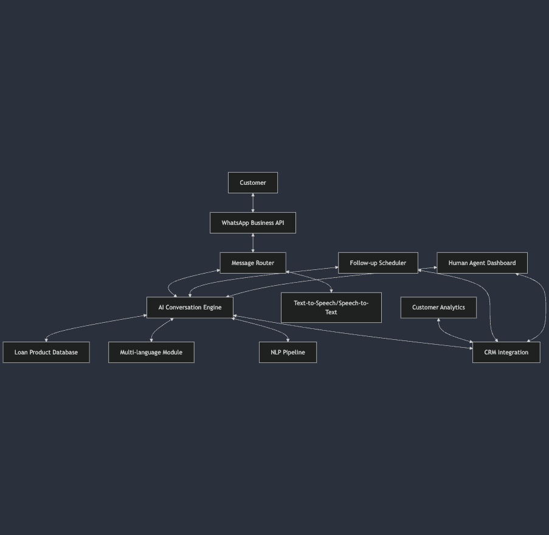

# WhatsApp Loan-Against-Property AI Agent

A Django-based AI agent system that uses WhatsApp Business API to engage with potential customers for Loan-Against-Property (LAP) products. The agent handles the entire customer journey from initial contact through qualification, objection handling, and follow-up scheduling with built-in multilingual support.

## Project Background

Financial institutions often struggle with efficient customer outreach for loan products. Cold calls and emails have low engagement rates, and human agents can only handle a limited number of conversations. 

This AI agent solution leverages WhatsApp's high engagement platform to:

1. Automatically reach out to potential loan-against-property customers
2. Engage them in natural conversation across multiple languages
3. Qualify leads by collecting property and loan requirement details
4. Address common objections and concerns
5. Schedule appropriate follow-ups
6. Hand over qualified leads to human loan officers

## Key Features

- **Complete Conversation Flow**: Manages the entire customer journey from initial contact to application handover
- **Multilingual Support**: Fully supports English, Hindi, Kannada, Tamil, and Telugu
- **Voice Message Processing**: Can receive and send voice notes for a more natural experience
- **Intelligent Intent Detection**: Accurately identifies customer intent through conversation
- **Information Extraction**: Automatically extracts property details and loan requirements
- **Objection Handling**: Addresses common objections with expert responses
- **Smart Follow-up Scheduling**: Uses AI to determine optimal follow-up timing
- **Campaign Management**: Create and manage outreach campaigns to multiple customers
- **Human Handover**: Seamlessly transfers conversations to human agents when needed
- **Simulator Interface**: Test the system without actual WhatsApp Business API

## System Architecture



The system is built with the following components:

1. **WhatsApp Business API Integration**: Handles message sending/receiving with proper rate limiting

2. **Conversational AI Engine**: 
   - Manages conversation flow across different states
   - Detects customer intent and sentiment
   - Extracts relevant information about property and loan requirements
   - Generates contextually appropriate responses

3. **Multi-language Support**:
   - Handles English, Hindi, Kannada, Tamil, and Telugu
   - Includes language detection, translation, speech-to-text, and text-to-speech

4. **Customer Data Management**:
   - Stores customer information, property details, and loan requirements
   - Tracks conversation history and interest level
   - Implements proper data retention and privacy controls

5. **Follow-up Strategy**:
   - Intelligently schedules follow-ups based on customer interest
   - Uses market triggers for re-engagement
   - Customizes messaging based on previous conversation context

## Project Setup

### Prerequisites

- Python 3.9+
- Redis (for Celery task queue)
- PostgreSQL (recommended for production) or SQLite (for development)
- OpenAI API key (for AI conversation capabilities)

### Installation

1. Clone the repository:
   ```bash
   git clone https://github.com/yourusername/whatsapp_loan_agent.git
   cd whatsapp_loan_agent
   ```

2. Create and activate a virtual environment:
   ```bash
   python -m venv venv
   source venv/bin/activate  # On Windows: venv\Scripts\activate
   ```

3. Install dependencies:
   ```bash
   pip install -r requirements.txt
   ```

4. Set up environment variables in a `.env` file:
   ```
   # Django settings
   DJANGO_SECRET_KEY=your_secret_key
   DJANGO_DEBUG=True
   
   # AI settings
   OPENAI_API_KEY=your_openai_api_key
   
   # WhatsApp settings (optional for simulator mode)
   WHATSAPP_API_KEY=your_whatsapp_api_key
   WHATSAPP_PHONE_NUMBER_ID=your_phone_number_id
   WHATSAPP_BUSINESS_ACCOUNT_ID=your_business_account_id
   WHATSAPP_VERIFY_TOKEN=your_verify_token
   
   # Set to True to use simulator instead of actual WhatsApp API
   USE_WHATSAPP_SIMULATOR=True
   ```

5. Run database migrations:
   ```bash
   python manage.py makemigrations
   python manage.py migrate
   ```

6. Load initial data:
   ```bash
   python manage.py loaddata initial_data.json
   ```

7. Create the required prompt directories and files:
   ```bash
   mkdir -p prompts/english prompts/hindi prompts/kannada prompts/tamil prompts/telugu
   ```
   
   Copy the provided prompt JSON files to their respective language directories.

8. Create a superuser for admin access:
   ```bash
   python manage.py createsuperuser
   ```

### Running the System

1. Start the Django development server:
   ```bash
   python manage.py runserver
   ```

2. Start Celery worker (in a separate terminal):
   ```bash
   celery -A whatsapp_loan_agent worker -l info
   ```

3. Start Celery beat for scheduled tasks (in another separate terminal):
   ```bash
   celery -A whatsapp_loan_agent beat -l info
   ```

4. Access the system:
   - Admin interface: http://localhost:8000/admin/
   - WhatsApp simulator: http://localhost:8000/simulator/

## Using the WhatsApp Simulator

The simulator lets you test the AI agent without an actual WhatsApp Business API integration:

1. Ensure `USE_WHATSAPP_SIMULATOR=True` is set in your environment or `.env` file
2. Visit http://localhost:8000/simulator/ in your browser
3. You'll see a WhatsApp-like interface where you can:
   - Send text messages to the agent
   - Test voice messages (if your browser supports audio recording)
   - View the agent's responses
   - Test in different languages

### Example Conversation Flow

Try these example messages to test the complete conversation flow:

1. "Hi, I need a loan against my property"
2. "I have a house in Bangalore worth 1.5 crore"
3. "I need about 80 lakhs for my business expansion"
4. "What would be the interest rate?"
5. "What documents will I need to provide?"
6. "I'll think about it and get back to you later"

## WhatsApp Business API Integration

For production use with the actual WhatsApp Business API:

1. Create a Meta Business account and apply for WhatsApp Business API access
2. Set up your WhatsApp Business API through Meta Business Manager
3. Create and get approval for message templates
4. Configure webhook URL to point to your deployed server's `/webhook/` endpoint
5. Set `USE_WHATSAPP_SIMULATOR=False` and provide the required API credentials in environment variables

## Development

### Code Organization

- `agent/` - Main application with models and views
- `core/` - Core components for WhatsApp, conversation, and language processing
- `simulator/` - WhatsApp simulator for local testing
- `prompts/` - Conversation prompts in different languages

## Extending the System

### Adding New Languages

1. Create a new prompt directory for the language: `mkdir -p prompts/new_language`
2. Create a `prompts.json` file with translated prompts
3. Add the language to the supported languages in `core/language.py`

### Customizing Conversation Flow

The conversation flow is defined by states in `core/conversation.py`. You can modify:

1. The state definitions in the `State` class
2. The state transitions in the `__init__` method
3. The prompts used for each state

### Adding New Features

To add new features:

1. Update models in `agent/models.py` if needed
2. Add new functionality to core components in `core/`
3. Update views in `agent/views.py` for new endpoints
4. Add tests for new functionality

## License

[MIT License](LICENSE)

## Acknowledgements

- [OpenAI](https://openai.com/) for AI conversation capabilities
- [Django](https://www.djangoproject.com/) for the web framework
- [Celery](https://docs.celeryproject.org/) for task queue management
- [WhatsApp Business API](https://developers.facebook.com/docs/whatsapp) for messaging capabilities